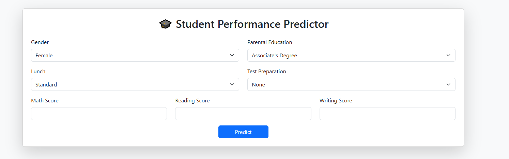

# 🎓 Student Performance Predictor

A machine learning web application that predicts whether a student will pass or fail based on academic scores and demographic information. The model is trained on real-world data and deployed using Flask, with an intuitive web interface.

## 📌 Overview

This project uses a Random Forest Classifier trained on student performance data, including math, reading, and writing scores, as well as gender, parental education level, and test preparation status. It includes a web interface for user input and real-time prediction results.

## 🚀 Features

- Predicts pass/fail outcome from student performance data.
- Interactive web form with real-time results.
- Clean and responsive interface using Bootstrap.
- Model saved using Joblib for reuse.
- Local deployment with Flask.

## 🧠 Machine Learning Details

The model is a RandomForestClassifier trained on a dataset of student performance. It calculates the average of the three exam scores and labels students as 'pass' or 'fail' based on a defined threshold. The model achieved an accuracy of approximately 99.5%.

## 🛠️ Tools and Technologies

- Python
- Pandas and NumPy for data processing
- Scikit-learn for model training
- Flask for web app
- HTML5/CSS with Bootstrap for UI
- Joblib for saving and loading the model

## 📂 Files Included

- `app/app.py`: Flask backend with prediction logic
- `app/templates/index.html`: Web interface template
- `data/StudentsPerformance.csv`: The dataset used for training
- `model/student_model.pkl`: The trained model
- `notebook/training_notebook.ipynb`: Jupyter notebook used for training and preprocessing
- `requirements.txt`: List of Python dependencies
- `README.md`: Project documentation (this file)

## ▶️ How to Run the Project Locally

1. Clone the repository:
git clone https://github.com/FawazJW32/student-performance-predictor.git

2. Navigate to the project folder:
cd student-performance-predictor

3. Create and activate a virtual environment:
python -m venv venv
venv\Scripts\activate

4. Install dependencies:
pip install -r requirements.txt

5. Run the Flask app:
python app/app.py

6. Open your browser and go to:
http://127.0.0.1:5000/

## 📸 Screenshot

